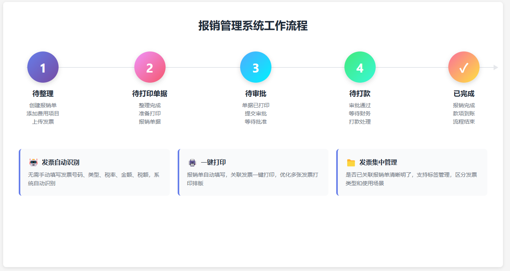
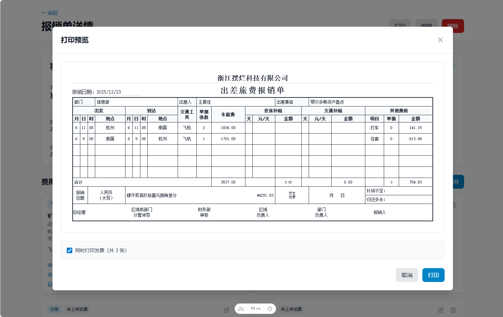
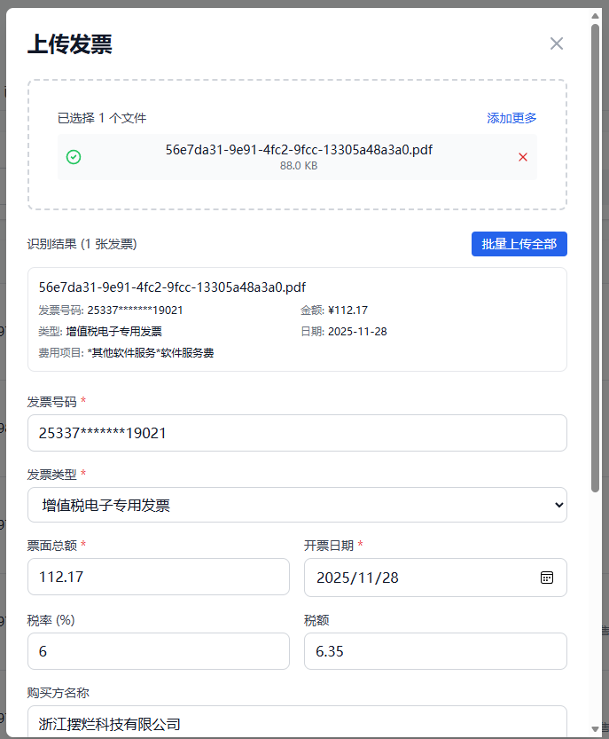
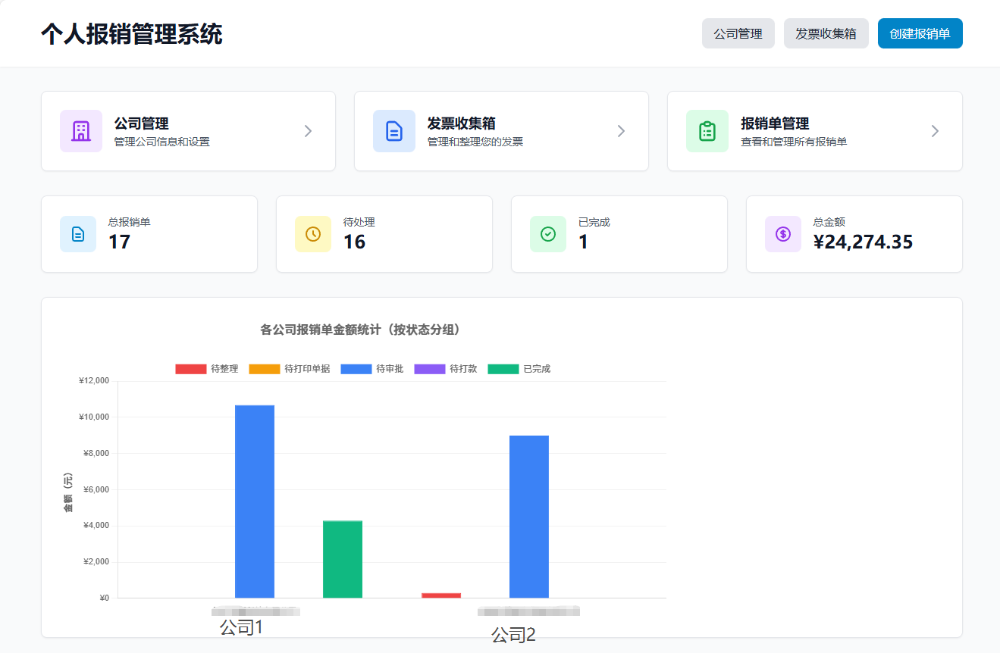
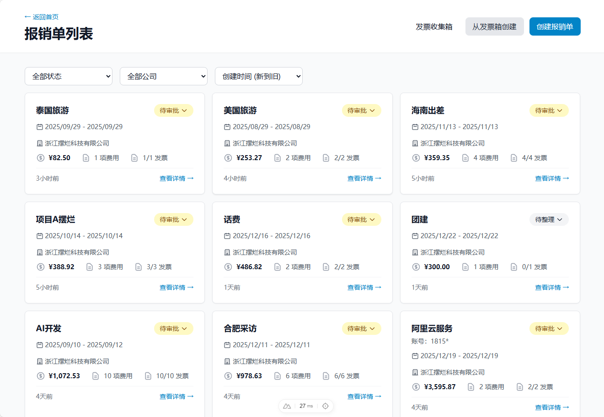
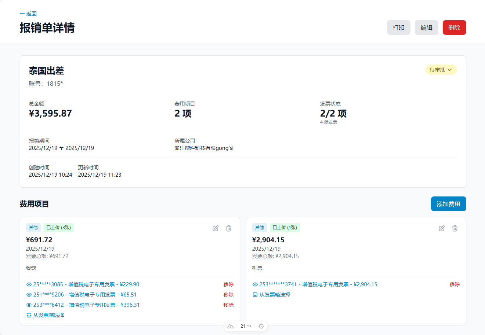

# 个人报销管理系统

一个基于 Nuxt 3 的个人报销管理平台，支持报销单管理、费用项目管理和发票文件上传。
优势
- ✅ 发票自动识别。无需手动填写发票号码、类型、税率、金额、税额
- ✅ 报销单一键打印。报销单自动填写，关联发票一键打印。且优化多张发票打印排版
- ✅ 发票集中管理。是否已经关联报销单清晰明了。增加标签管理，区分发票类型、使用场景（如替票）
- ✅ 费用与发票自动计算。发票是否上传，金额是否匹配自动计算






## 项目简介

这是一个为个人或小团队设计的报销管理系统，旨在简化报销流程，提高报销效率。系统提供了完整的报销单生命周期管理，从创建、整理、打印、审批到最终打款的全流程跟踪。

### 主要特点

- 🚀 **现代化技术栈** - 基于 Nuxt 3 + TypeScript + Tailwind CSS
- 📊 **可视化统计** - 直观的数据统计图表和仪表盘
- 📁 **发票箱管理** - 集中管理所有发票，支持批量操作和标签分类
- 🖨️ **打印预览** - 内置 PDF 打印预览功能，支持客户端渲染
- 📱 **响应式设计** - 适配各种屏幕尺寸
- 💾 **本地存储** - 使用 SQLite 数据库，无需额外配置

## 功能特性

### 1. 报销单管理



- ✅ 创建、编辑、删除报销单
- ✅ 报销单列表查看（支持筛选和排序）
- ✅ 报销单详情页面
- ✅ 五阶段状态流程：
  - 待整理
  - 待打印单据
  - 待审批
  - 待打款
  - 已完成
- ✅ 状态流转管理
- ✅ 报销单打印预览



### 2. 费用项目管理

- ✅ 添加、编辑、删除费用项目
- ✅ 费用项目字段：
  - 金额
  - 日期
  - 类别（交通、餐饮、住宿、办公、其他）
  - 描述
- ✅ 自动计算报销单总金额
- ✅ 费用项目排序和筛选
- ✅ 批量操作支持

### 3. 发票管理


- ✅ 发票自动识别，无需手动填写发票号码、类型、税率、金额、税额
- ✅ 上传发票文件（PDF, PNG, JPG, JPEG）
- ✅ 文件大小限制：10MB
- ✅ 发票状态跟踪（未使用/已使用）
- ✅ 查看和删除发票
- ✅ 拖拽上传支持
- ✅ 发票箱集中管理
- ✅ 批量标签功能
- ✅ 发票预览和下载
- ✅ PDF 客户端渲染

### 4. 数据统计

- ✅ 首页仪表盘
- ✅ 统计数据：
  - 总报销单数量
  - 待处理报销单
  - 已完成报销单
  - 总金额统计
- ✅ 可视化图表展示
- ✅ 按状态统计
- ✅ 按类别统计

## 技术栈

### 核心技术
- **前端框架**: [Nuxt 3](https://nuxt.com/) - Vue 3 全栈框架
- **UI 样式**: [Tailwind CSS](https://tailwindcss.com/) - 实用优先的 CSS 框架
- **数据库**: SQLite - 轻量级关系型数据库
- **ORM**: [Prisma](https://www.prisma.io/) - 现代化数据库工具
- **语言**: TypeScript - 类型安全的 JavaScript 超集
- **文件存储**: 本地文件系统

### 主要依赖
- **PDF 处理**: PDF.js - 客户端 PDF 渲染
- **图表库**: Chart.js - 数据可视化
- **图标**: Heroicons - 精美的 SVG 图标库
- **日期处理**: 原生 JavaScript Date API

## 项目结构

```
reim-system/
├── .claude/                   # Claude Code 配置
│   ├── CLAUDE.md             # 项目使用规范
│   └── settings.local.json   # 本地设置
├── prisma/                    # Prisma 数据库配置
│   ├── schema.prisma         # 数据库模型定义
│   └── dev.db                # SQLite 数据库文件
├── server/                    # 服务端代码
│   ├── api/                  # API 路由
│   │   ├── reimbursements/   # 报销单 API
│   │   │   ├── index.get.ts  # 获取报销单列表
│   │   │   ├── index.post.ts # 创建报销单
│   │   │   ├── [id].get.ts   # 获取单个报销单
│   │   │   ├── [id].put.ts   # 更新报销单
│   │   │   ├── [id].delete.ts # 删除报销单
│   │   │   └── stats.get.ts  # 统计数据
│   │   ├── invoice-box/      # 发票箱 API
│   │   │   ├── index.get.ts  # 获取发票列表
│   │   │   └── batch-tag.post.ts # 批量标签
│   │   └── uploads/          # 文件上传 API
│   │       ├── invoice.post.ts # 上传发票
│   │       └── [filename].delete.ts # 删除发票
│   └── utils/                # 服务端工具函数
├── pages/                     # 页面组件
│   ├── index.vue             # 首页/仪表盘
│   ├── invoice-box.vue       # 发票箱页面
│   └── reimbursements/       # 报销单相关页面
│       ├── index.vue         # 报销单列表
│       ├── [id].vue          # 报销单详情
│       └── new.vue           # 创建报销单
├── components/                # Vue 组件
│   ├── ui/                   # 基础 UI 组件
│   ├── reimbursement/        # 报销单组件
│   ├── expense/              # 费用项目组件
│   ├── invoice/              # 发票组件
│   └── ReimbursementStatsChart.vue # 统计图表
├── composables/               # 组合式函数
│   ├── useReimbursements.ts  # 报销单逻辑
│   └── useInvoiceBox.ts      # 发票箱逻辑
├── types/                     # TypeScript 类型定义
│   └── index.ts              # 全局类型
├── utils/                     # 工具函数
│   └── format.ts             # 格式化工具
├── public/                    # 静态资源
│   ├── uploads/              # 上传的发票文件
│   │   └── invoices/         # 发票存储目录
│   └── lib/                  # 第三方库
│       └── pdf.js/           # PDF.js 库文件
├── doc/                       # 文档目录
│   └── screenshots/          # 截图目录
├── scripts/                   # 脚本文件
│   └── migrate-*.ts          # 数据迁移脚本
├── nuxt.config.ts            # Nuxt 配置
├── tailwind.config.js        # Tailwind 配置
├── tsconfig.json             # TypeScript 配置
└── package.json              # 项目依赖
```

## 快速开始

### 环境要求

- Node.js >= 18.0.0
- npm >= 9.0.0

### 1. 克隆项目

```bash
git clone <repository-url>
cd reim-system
```

### 2. 安装依赖

```bash
npm install
```

### 3. 初始化数据库

数据库已经在项目初始化时自动创建。如需重新初始化：

```bash
# 同步数据库模型
npx prisma db push

# 生成 Prisma 客户端
npx prisma generate
```

### 4. 启动开发服务器

```bash
npm run dev
```

访问 http://localhost:3000 查看应用。

### 5. 构建生产版本

```bash
# 构建应用
npm run build

# 预览生产版本
npm run preview
```

## 数据库模型

### Reimbursement (报销单)

| 字段 | 类型 | 说明 |
|------|------|------|
| `id` | String | 唯一标识符 (UUID) |
| `title` | String | 报销单标题 |
| `description` | String? | 报销单描述（可选） |
| `status` | String | 状态（待整理/待打印单据/待审批/待打款/已完成） |
| `totalAmount` | Decimal | 总金额（自动计算） |
| `createdAt` | DateTime | 创建时间 |
| `updatedAt` | DateTime | 更新时间 |
| `items` | ExpenseItem[] | 关联的费用项目列表 |

### ExpenseItem (费用项目)

| 字段 | 类型 | 说明 |
|------|------|------|
| `id` | String | 唯一标识符 (UUID) |
| `reimbursementId` | String? | 关联的报销单 ID（可选） |
| `amount` | Decimal | 费用金额 |
| `date` | DateTime | 费用发生日期 |
| `description` | String? | 费用描述（可选） |
| `category` | String | 费用类别 |
| `invoiceFileName` | String? | 发票文件名 |
| `invoiceFilePath` | String? | 发票文件路径 |
| `hasInvoice` | Boolean | 是否已上传发票 |
| `invoiceStatus` | String | 发票状态（未使用/已使用） |
| `tags` | String[] | 标签列表 |
| `createdAt` | DateTime | 创建时间 |
| `updatedAt` | DateTime | 更新时间 |
| `reimbursement` | Reimbursement? | 关联的报销单 |

### 数据库关系

- 一个报销单可以包含多个费用项目（一对多）
- 费用项目可以独立存在（发票箱中的未使用发票）
- 删除报销单时，关联的费用项目会自动解除关联

## API 端点

### 报销单 API

| 方法 | 端点 | 说明 | 参数 |
|------|------|------|------|
| GET | `/api/reimbursements` | 获取报销单列表 | `status?`: 状态筛选 |
| POST | `/api/reimbursements` | 创建报销单 | `title`, `description?`, `status` |
| GET | `/api/reimbursements/:id` | 获取单个报销单详情 | - |
| PUT | `/api/reimbursements/:id` | 更新报销单 | `title?`, `description?`, `status?` |
| DELETE | `/api/reimbursements/:id` | 删除报销单 | - |
| GET | `/api/reimbursements/stats` | 获取统计数据 | - |

### 费用项目 API

| 方法 | 端点 | 说明 | 参数 |
|------|------|------|------|
| POST | `/api/reimbursements/:id/items` | 创建费用项目 | `amount`, `date`, `category`, `description?` |
| PUT | `/api/reimbursements/:id/items/:itemId` | 更新费用项目 | `amount?`, `date?`, `category?`, `description?` |
| DELETE | `/api/reimbursements/:id/items/:itemId` | 删除费用项目 | - |

### 发票箱 API

| 方法 | 端点 | 说明 | 参数 |
|------|------|------|------|
| GET | `/api/invoice-box` | 获取发票箱列表 | `status?`: 状态筛选, `tags?`: 标签筛选 |
| POST | `/api/invoice-box/batch-tag` | 批量添加标签 | `itemIds`, `tags` |

### 文件上传 API

| 方法 | 端点 | 说明 | 参数 |
|------|------|------|------|
| POST | `/api/uploads/invoice` | 上传发票文件 | `file`: 文件对象 |
| DELETE | `/api/uploads/:filename` | 删除发票文件 | - |

## 使用说明

### 基本工作流程


#### 1. 创建报销单
1. 在首页或报销单列表页点击"创建报销单"按钮
2. 填写报销单标题和描述
3. 选择初始状态（通常为"待整理"）
4. 点击"保存"创建报销单

#### 2. 添加费用项目
1. 进入报销单详情页
2. 点击"添加费用"按钮
3. 填写费用信息：
   - 金额：费用金额
   - 日期：费用发生日期
   - 类别：选择费用类别（交通、餐饮、住宿、办公、其他）
   - 描述：费用说明（可选）
4. 点击"保存"添加费用项目
5. 系统会自动计算并更新报销单总金额

#### 3. 上传发票
**方式一：在费用项目中上传**
1. 在费用项目卡片中点击"上传发票"按钮
2. 拖拽文件或点击选择文件
3. 支持的格式：PDF, PNG, JPG, JPEG
4. 最大文件大小：10MB
5. 上传成功后，发票会自动关联到该费用项目

**方式二：使用发票箱**
1. 点击导航栏的"发票箱"进入发票箱页面
2. 上传发票文件（支持批量上传）
3. 发票会显示为"未使用"状态
4. 在创建费用项目时，可以从发票箱中选择已上传的发票
5. 选择后，发票状态会自动更新为"已使用"

#### 4. 管理发票箱
1. 在发票箱页面可以查看所有发票
2. 使用筛选功能查看"未使用"或"已使用"的发票
3. 批量选择发票并添加标签进行分类
4. 点击发票可以预览（支持 PDF 和图片格式）
5. 删除不需要的发票

#### 5. 更新报销单状态
1. 进入报销单详情页
2. 点击状态下拉菜单
3. 选择新的状态：
   - **待整理**：初始状态，正在整理费用和发票
   - **待打印单据**：费用整理完成，准备打印报销单据
   - **待审批**：单据已打印，等待审批
   - **待打款**：审批通过，等待财务打款
   - **已完成**：报销流程完成
4. 状态会自动保存

#### 6. 打印报销单
1. 在报销单详情页点击"打印"按钮
2. 系统会生成 PDF 格式的报销单
3. 可以在预览窗口中查看
4. 点击"打印"按钮进行打印

#### 7. 查看统计数据
1. 在首页仪表盘查看整体统计
2. 查看报销单数量、金额统计
3. 查看按状态和类别的分布图表

## 注意事项

### 系统特性
- ✅ 这是一个单用户应用，无需登录认证
- ✅ 所有数据存储在本地 SQLite 数据库中
- ✅ 发票文件存储在本地 `public/uploads/invoices/` 目录
- ✅ 报销单的总金额会根据费用项目自动计算

### 数据安全
- ⚠️ 删除报销单时，关联的费用项目会自动解除关联（不会删除）
- ⚠️ 删除费用项目时，相关的发票文件会自动删除
- ⚠️ 建议定期备份数据库文件 `prisma/dev.db`
- ⚠️ 建议定期备份上传的发票文件

### 文件限制
- 📁 支持的发票格式：PDF, PNG, JPG, JPEG
- 📁 单个文件最大大小：10MB
- 📁 文件名会自动添加时间戳以避免冲突

### 浏览器兼容性
- ✅ Chrome/Edge (推荐)
- ✅ Firefox
- ✅ Safari
- ⚠️ 需要支持现代 JavaScript 特性的浏览器

## 开发命令

### 常用命令

```bash
# 安装依赖
npm install

# 启动开发服务器（默认端口 3000）
npm run dev

# 构建生产版本
npm run build

# 预览生产版本
npm run preview

# 类型检查
npm run typecheck
```

### 数据库命令

```bash
# 生成 Prisma 客户端
npx prisma generate

# 同步数据库模型（开发环境）
npx prisma db push

# 创建数据库迁移（生产环境）
npx prisma migrate dev

# 打开 Prisma Studio（数据库管理界面）
npx prisma studio

# 查看数据库结构
npx prisma db pull
```

### 数据迁移脚本

```bash
# 迁移费用类别数据
npx tsx scripts/migrate-expense-categories.ts

# 迁移发票箱数据
npx tsx scripts/migrate-invoices-to-invoice-box.ts
```

## 常见问题

### 1. 数据库文件损坏怎么办？

如果数据库文件损坏，可以从备份恢复：

```bash
# 停止开发服务器
# 恢复备份文件
cp prisma/dev.db.backup prisma/dev.db
# 重新启动服务器
npm run dev
```

### 2. 如何清空所有数据？

```bash
# 删除数据库文件
rm prisma/dev.db
# 重新创建数据库
npx prisma db push
```

### 3. 上传的文件在哪里？

所有上传的发票文件存储在 `public/uploads/invoices/` 目录中。

### 4. 如何备份数据？

```bash
# 备份数据库
cp prisma/dev.db prisma/dev.db.backup-$(date +%Y%m%d-%H%M%S)

# 备份发票文件
cp -r public/uploads/invoices public/uploads/invoices.backup-$(date +%Y%m%d-%H%M%S)
```

### 5. 如何修改端口号？

在启动命令中指定端口：

```bash
PORT=3001 npm run dev
```

## 功能路线图

### 已完成 ✅
- [x] 报销单基础 CRUD
- [x] 费用项目管理
- [x] 发票上传和管理
- [x] 发票箱功能
- [x] 批量标签功能
- [x] 数据统计和图表
- [x] PDF 打印预览
- [x] 响应式设计

### 计划中 📋
- [ ] 多用户支持和权限管理
- [ ] 报销单审批流程
- [ ] 邮件通知功能
- [ ] 数据导出（Excel/CSV）
- [ ] 发票 OCR 识别
- [ ] 移动端 App
- [ ] 云端同步功能
- [ ] 报表和分析功能

## 贡献指南

欢迎贡献代码！请遵循以下步骤：

1. Fork 本仓库
2. 创建特性分支 (`git checkout -b feature/AmazingFeature`)
3. 提交更改 (`git commit -m 'Add some AmazingFeature'`)
4. 推送到分支 (`git push origin feature/AmazingFeature`)
5. 开启 Pull Request

### 代码规范

- 使用 TypeScript 编写代码
- 遵循 ESLint 规则
- 提交前进行类型检查
- 编写清晰的提交信息

## 技术支持

如果您遇到问题或有建议，请：

1. 查看[常见问题](#常见问题)部分
2. 在 GitHub Issues 中搜索类似问题
3. 创建新的 Issue 并详细描述问题

## 更新日志

### v1.0.0 (2025-12-23)
- 🎉 初始版本发布
- ✨ 完整的报销单管理功能
- ✨ 发票箱和批量标签功能
- ✨ 数据统计和可视化
- ✨ PDF 打印预览功能

## 许可证

MIT License

Copyright (c) 2025

Permission is hereby granted, free of charge, to any person obtaining a copy
of this software and associated documentation files (the "Software"), to deal
in the Software without restriction, including without limitation the rights
to use, copy, modify, merge, publish, distribute, sublicense, and/or sell
copies of the Software, and to permit persons to whom the Software is
furnished to do so, subject to the following conditions:

The above copyright notice and this permission notice shall be included in all
copies or substantial portions of the Software.

THE SOFTWARE IS PROVIDED "AS IS", WITHOUT WARRANTY OF ANY KIND, EXPRESS OR
IMPLIED, INCLUDING BUT NOT LIMITED TO THE WARRANTIES OF MERCHANTABILITY,
FITNESS FOR A PARTICULAR PURPOSE AND NONINFRINGEMENT. IN NO EVENT SHALL THE
AUTHORS OR COPYRIGHT HOLDERS BE LIABLE FOR ANY CLAIM, DAMAGES OR OTHER
LIABILITY, WHETHER IN AN ACTION OF CONTRACT, TORT OR OTHERWISE, ARISING FROM,
OUT OF OR IN CONNECTION WITH THE SOFTWARE OR THE USE OR OTHER DEALINGS IN THE
SOFTWARE.

---

**Made with ❤️ using Nuxt 3**
